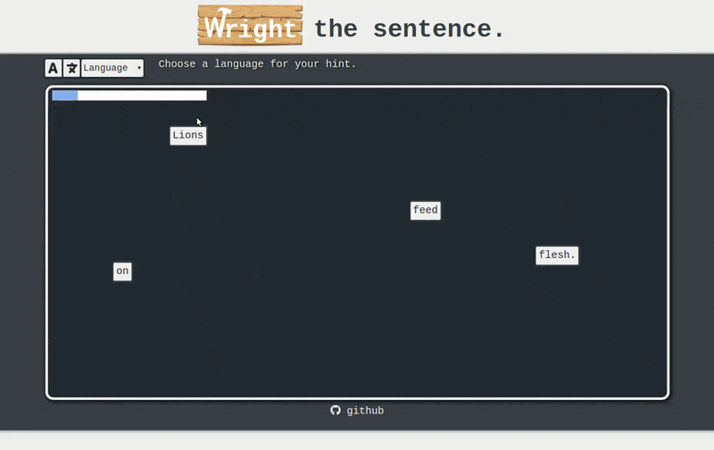

#Wright

# Background

Wright is a web app that lets people study English and eventually other languages by creating sentences out of a given set of words. The premise being that this will help users learn new words and sentence structure. A translated version of the sentence will appear for guidance.  When the words are arranged in the correct order of the sentence a new sentence puzzle will load. 

# Functionality & MVP

- import a sentence
- get a translation of the sentence from google translate
- split the original sentence into words
- let users drag the words on the screen
- fetches a new sentence when the words are in the correct order
- a production README

# Wireframes

wireframe.png

The top of the screen will have a dropdown menu that lets you select what language you want the imported sentence to be translated to. Below will be a container that contains the randomly distributed words. This is all that is needed for the mvp. Other possible features would be a progress bar, to add a time limit, a score, and how many sentences you have built in the session. 

look at wireframe.png for reference.

# Architecture and Technologies

I have a list of 1.3 million English sentences in a .tsv file from taboeta. I will put these in a database and fetch a sentence on a page load. I then plan to send the sentence through google's translate api. The sentence string will be split and be rendered on the screen using javascript. There will also be a check to make sure each word is left of the word after it. When that check is complete a new sentence will be fetched from the database and new words will be rendered.

# Implementation Timeline

### Day 1: 
- build a skeleton
- connect with the database and translate api. 

### Day 2: 
- make a div that is draggable.
- build logic to check that div is left of a second div.

### Day 3: 
- make divs based on the length of the sentence. 
- assign a word to each div.
- build a sentence correct check.

### Day 4:
- add translated sentence to the page.
- add language options.
- add progress bar.

# Bonus Features
- have google translate read the sentence out loud after the user finishes the sentence.
- have a timer
- have a score system
- let users choose the difficulty
- add more languages to the database so users can practice other languages.

