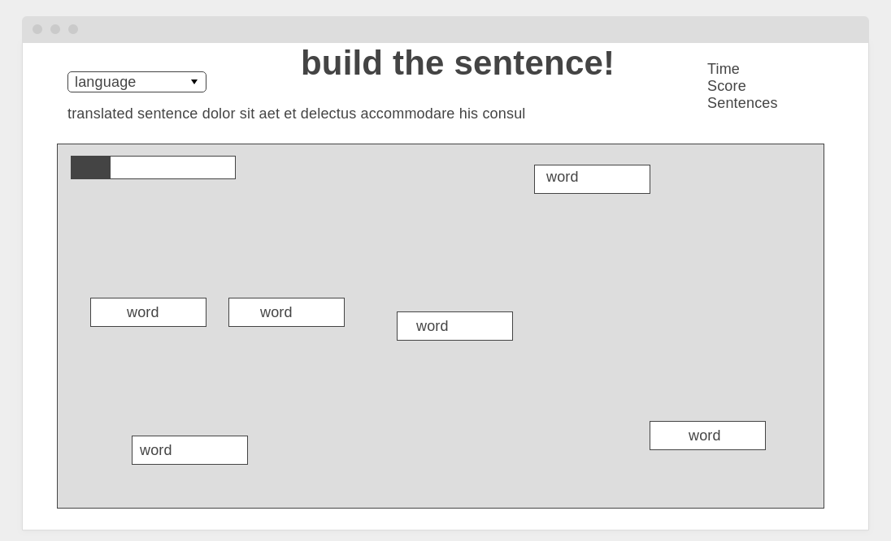

# Wright


# Background

Wright is a web app that lets people study English and eventually other languages by creating sentences out of a given set of words. The premise being that this will help users learn new words and sentence structure. Users can get a translated version of the sentence to appear for guidance. When the words are arranged in the correct order of the sentence a new sentence puzzle will load. 

# Functionality & MVP

- import a sentence
- get a translation of the sentence from google translate
- split the original sentence into words
- let users drag the words on the screen
- fetches a new sentence when the words are in the correct order
- a production README

# Wireframes



The top of the screen will have a dropdown menu that lets you select what language you want the imported sentence to be translated to. Below will be a container that contains the randomly distributed words. This is all that is needed for the mvp. Other possible features would be a progress bar, to add a time limit, a score, and how many sentences you have built in the session. 

# Architecture and Technologies

I have a list of 1.3 million English sentences in a .tsv file from taboeta. I filtered down to 20,000 sentence. I put these in a database and fetch a sentence on a page load. I then send the sentence through google's translate api. The sentence string will is split and be rendered on the screen using javascript. Then it is checked to make sure each word is in the correct position. When that check is complete a new sentence will be fetched from the database and the new words will be rendered.

# Sentence Checking Algorithm

An interesting challenge was figuring out how to check if the sentence was complete. This seems as simple as matching but many problems arose. Firstly you want the words close together which means you have to find the location of each word. I do this by having each word reference the word left of it and make sure it is less than 50 pixels above or below and less than 200 to the right. Next a check was put in to check the order. This had many unforseen challenges too. Sentences with word double or tripples caused problems "The boy has **to** go **to** school." I had to make sure users could switch the two **to**'s otherwise the experience would be frustrating. For that reason I had to target the actual words and not the divs to compare. I also set an interval function to every half second so it wouldnt register correct if you dragged it past a correct spot. Finally I assigned "points" to each of these checks and filled the progress bar depending on how close they were. Below is the check code. 

```js
   let demo = () => {
    //checks every half second to see if sentence is correct
    let interval = setInterval(() => {
      let wordCollection = document.getElementById("words").getElementsByTagName("div");
      let correctLayout = Array.from(wordCollection)
      let currentLayout =  Array.from(wordCollection).sort(
         (one, two) => Math.sign(one.offsetLeft - two.offsetLeft)
      )
      
      // checks order, height, and spacing.
      let finalCheck = 0
      let perfectCheck = currentLayout.length * 3 - 3

      for (let i = 1; i < currentLayout.length; i++) {
        if (correctLayout[i].innerHTML === (currentLayout[i].innerHTML)) {
          finalCheck += 1
        }
        let height = Math.abs(currentLayout[i - 1].offsetTop - currentLayout[i].offsetTop)
        if (height < 50) {
          finalCheck += 1
        }
        let left = Math.abs(currentLayout[i - 1].offsetLeft - currentLayout[i].offsetLeft)
        if (left < 200 && left > 20) {
          finalCheck += 1 
        }
      }

      // makes progress bar fill up
      document.getElementById("progress").style.width = `${(finalCheck) / (perfectCheck) * 300}px`;

      //win condition
      if (finalCheck === perfectCheck ) {
        clearInterval(interval)
        document.getElementById("win").style.borderColor = "#1ef325"
        document.getElementById("correct").play()
        setTimeout(() => {location.reload()}, 3000);
      }  //////////
    }, 500)
  }
```

# Implementation Timeline

### Day 1: 
- build a skeleton
- connect with the database and translate api. 

### Day 2: 
- make a div that is draggable.
- build logic to check that div is left of a second div.

### Day 3: 
- make divs based on the length of the sentence. 
- assign a word to each div.
- build a sentence correct check.

### Day 4:
- add translated sentence to the page.
- add language options.
- add progress bar.

# Bonus Features
- have google translate read the sentence out loud after the user finishes the sentence.
- have a timer
- have a score system
- let users choose the difficulty
- add more languages to the database so users can practice other languages.

